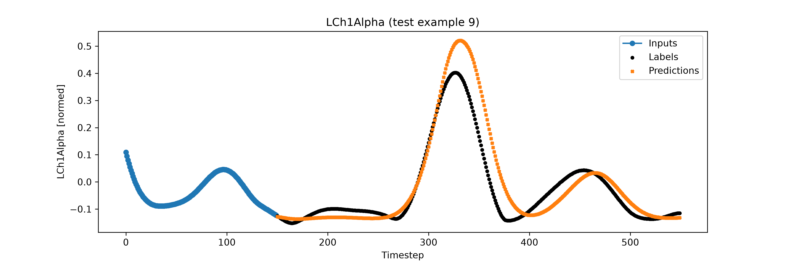
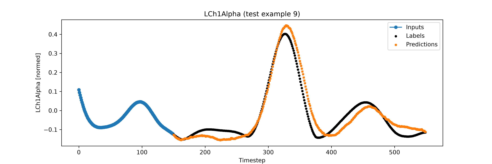

# FeedBack LSTM: forecasting brain band powers during gait under DBS

This project trains LSTM models to forecast brain-signal band powers (Delta, Theta, Alpha, Beta, Gamma) recorded during gait cycles, given the patient's deep brain stimulation (DBS) settings. A model sees the first 150 timesteps of a gait cycle and predicts the next 400.

Two models are compared with each other and with simple non-learned baselines, on the same test data:
- **FeedBack** (closed loop): predicts one timestep at a time, feeding each prediction back in as its next input.
- **DirectLSTM**: reads the same input and predicts all 400 timesteps at once.

**Result:** after Bayesian hyperparameter tuning, both models clearly beat the baselines. The direct model is the more accurate of the two: its test error is **57% lower** than the best baseline and **11% lower** than FeedBack's, with a much smaller network.

---

## Contents
- [How it works](#how-it-works)
- [Results](#results)
- [Files](#files)
- [Setup](#setup)
- [How to run](#how-to-run)
- [Limitations](#limitations)

---

## How it works

### 1. Data
The data is 6 recording sessions, each stored as a `.mat` file. Each session holds 80–94 gait cycles, and each gait cycle is an array of shape `(timesteps, 45)`, with 604–694 timesteps per cycle:

| Columns | Meaning |
|---|---|
| 0–3 | DBS settings: `DBSLAmp`, `DBSLFreq`, `DBSRAmp`, `DBSRFreq` |
| 4–43 | Band powers: Left/Right × Channel 1–4 × Delta/Theta/Alpha/Beta/Gamma |
| 44 | `WPI` |

The models use 9 of these columns: the 4 DBS settings and the 5 Left Channel 1 band powers (Delta to Gamma). The band powers are both inputs and prediction targets; the DBS settings are inputs only. To predict other bands, edit `PREDICTED_FEATURES` in [dataset.py](dataset.py).

These arrays were extracted from the raw session structure (wavelet power, averaged over each band's frequency range with `trapz`, and cut into gait cycles using the gait events).

### 2. Train / validation / test split
Each session is split **chronologically by gait cycle** into 60% train, 20% validation and 20% test. The six sessions are then pooled, giving **312 / 106 / 106 gait cycles**. Every split therefore contains cycles from every session.


### 3. Normalization and windowing
- Every column is mean-normalized, `(x − mean) / (max − min)`, with statistics from the training split only.
- Each gait cycle is cut into windows of **150 input steps → 400 predicted steps**. Training and validation windows start every 5 timesteps (5,647 and 1,961 windows). For testing, one window is taken from the start of each gait cycle (106 windows).


### 4. The models
Both models have two stacked LSTM layers followed by two Dense layers, and are trained with MAE loss and Adam ([modelutils.py](modelutils.py)).

**FeedBack**
1. **Warm-up:** the whole input window passes through both LSTM layers, which produces the first prediction.
2. **Feedback loop:** for each of the remaining 399 steps, the previous prediction is joined with the DBS settings and fed back into the LSTM cells, one step at a time.


**DirectLSTM** reads the input window with the LSTM layers, then a Dense head outputs all 400 steps at once. It runs 150 LSTM steps per window instead of 549, so it trains much faster, and errors cannot build up from step to step.

### 5. Baselines
To show what the models add, they are compared with three forecasts that involve no learning ([baselines.py](baselines.py)):

| Baseline | Prediction for the 400 future steps |
|---|---|
| Last value | the last observed value of each band, repeated |
| Average cycle (all) | the mean of all training gait cycles at each timestep |
| Average cycle (session) | the mean of the training gait cycles from the same session |

Test windows start at the beginning of a gait cycle, so the average-cycle baselines capture the typical shape of a gait cycle. A model that beats them is using the input window, not just that typical shape.

---

## Results

### Hyperparameter search
[finetune.py](finetune.py) ran a Bayesian search (scikit-optimize) for each model over LSTM units, Dense units, learning rate, L2 weight and batch size, scoring each trial by its best validation MAE:

| Model | Trials | LSTM units | Dense units | Learning rate | L2 | Batch size | Best val MAE |
|---|---|---|---|---|---|---|---|
| FeedBack | 15 (≤ 20 epochs each) | 512 | 50 | 5.8e-5 | 2.2e-6 | 32 | 0.0521 |
| DirectLSTM | 30 (≤ 50 epochs each) | 32 | 128 | 1e-3 | 1e-6 | 32 | 0.0503 |

The two models want opposite settings:
- **FeedBack** needs a **low learning rate** and a large network. All four trials with a learning rate above 3e-4 were among the worst (val MAE ≈ 0.104): because each prediction is fed back in 400 times, large training steps make the closed loop unstable.
- **DirectLSTM** works best with a **high learning rate**, and its size barely matters. The best trial (512 units, val MAE 0.0501) and a 32-unit model (0.0503) were equally good; both were trained in full and reached the same test MAE (0.0468), so the 32-unit model, 13× smaller, was kept.

### Test results
Each model's chosen setting was trained to convergence with early stopping and evaluated on the 106 test windows:

| Method | Test MAE (normalized) | Delta | Theta | Alpha | Beta | Gamma |
|---|---|---|---|---|---|---|
| Last value | 0.1319 | 1.417 | 2.106 | 4.472 | 35.71 | 22.88 |
| Average cycle (session) | 0.1112 | 1.291 | 1.719 | 3.677 | 30.14 | 19.76 |
| Average cycle (all) | 0.1099 | 1.266 | 1.719 | 3.663 | 30.03 | 18.51 |
| FeedBack LSTM (512 units) | 0.0527 | 0.711 | 0.696 | 1.512 | 12.63 | 14.65 |
| **DirectLSTM (32 units)** | **0.0468** | **0.680** | **0.587** | **1.316** | **11.64** | **12.63** |

Per-band columns are MAE in original units (Left Channel 1).

- **Both models beat the baselines by a wide margin.** Compared with the best baseline (average cycle), the error is 52% lower for FeedBack and 57% lower for DirectLSTM.
- **DirectLSTM beats FeedBack in every band:** 11% lower error overall, from 4% (Delta) to 16% (Theta).
- **DirectLSTM is also far cheaper:** 32 LSTM units instead of 512, and about 7 minutes of training (Apple GPU) instead of about 6 hours (CPU).

**Alpha band, the same test window for both models.** Blue: input history. Black: true values. Orange: prediction.

FeedBack follows the rise to the main peak closely, then overshoots it and falls behind the true signal by about 10–20 timesteps: small timing errors carry forward through the feedback loop.



DirectLSTM tracks the peak's timing and height more closely, because each step is predicted from the input window rather than from its own earlier predictions.



---

## Files

| File | Purpose |
|---|---|
| [train.py](train.py) | **Main script.** Trains and evaluates FeedBack or DirectLSTM, compares it with the baselines, and saves weights, history, test predictions and plots |
| [finetune.py](finetune.py) | Bayesian hyperparameter search (`scikit-optimize`) on the same data and settings as `train.py` |
| [baselines.py](baselines.py) | Simple non-learned forecasts (last value, average gait cycle) that the models are compared against |
| [eda.py](eda.py) | Data summary: gait cycles per split, cycle lengths, column ranges, DBS settings per session, window shapes, and two plots |
| [dataset.py](dataset.py) | Column definitions and the shared data pipeline (load → split → normalize → windows) |
| [modelutils.py](modelutils.py) | The `FeedBack` and `DirectLSTM` models, plus `ModelUtils` (compile & fit, window building, plotting) |
| [utils.py](utils.py) | `LoadData` (reads the `.mat` sessions), `NormalizedData` (flatten / normalize / un-flatten variable-length gait cycles), `split_train_val_test` |
| [configs.py](configs.py) | Data and output paths, read from environment variables |
| [requirements.txt](requirements.txt) | Python packages |
| [docs/](docs/) | Figures used in this README |

Every script starts with a docstring explaining what it does and how to run it.

---

## Setup

Developed with Python 3.12 and TensorFlow 2.21 (Keras 3).

```bash
python -m venv .venv
source .venv/bin/activate
pip install -r requirements.txt
```

On Apple silicon, TensorFlow can use the GPU if the `tensorflow-metal` plugin is installed for a TensorFlow version it supports. The GPU speeds up DirectLSTM a lot, but FeedBack ran much faster on the CPU.

Then tell the code where your data is. The data itself (the patient `.mat` files) is **not** included in this repository. Paths are read from environment variables in [configs.py](configs.py):

| Variable | Contents | Default |
|---|---|---|
| `FEEDBACK_DATA_DIR` | folder with the patient `.mat` files | `./data` |
| `FEEDBACK_IMAGES_DIR` | plots | `./results/images` |
| `FEEDBACK_RESULTS_DIR` | weights, histories, predictions | `./results/models` |

Either put the `.mat` files in `./data`, or set the variables:

```bash
export FEEDBACK_DATA_DIR=/path/to/your/data
```

or put them in a `.env` file in this folder, one `NAME=value` per line (VS Code loads `.env` automatically when running Python files; `.env` is git-ignored).

---

## How to run

Run the scripts from inside this folder.

```bash
# 1. look at the data
python eda.py

# 2. score the baselines (seconds, no training)
python baselines.py

# 3. (optional) search for the best hyperparameters of each model -> <model>_best_hyperparams.json
python finetune.py --model direct
python finetune.py --model feedback --trials 15 --trial-epochs 20

# 4. train and evaluate each model with its chosen settings (BEST_SETTINGS in train.py) ...
python train.py --model direct
python train.py --model feedback
# ... or with the result of a new search
python train.py --model direct --hyperparams "$FEEDBACK_RESULTS_DIR/direct_best_hyperparams.json"
```

`finetune.py` options: `--trials` (default 30), `--trial-epochs` (maximum epochs per trial, default 50), `--patience` (default 5) and `--fresh`. An interrupted search resumes from its finished trials when run again; `--fresh` starts over (use it after changing the data or settings).

`train.py` options: `--epochs` (default 300), `--patience` (early-stopping patience, default 20) and `--hyperparams`. The window sizes and other fixed settings are at the top of the file.

**Training is safe to interrupt.** Progress is backed up after every epoch, and running the same command again resumes where it stopped. A FeedBack run takes several hours on a laptop CPU; on macOS, `caffeinate -i python train.py --model feedback` keeps the machine awake until it finishes.

**Outputs** are named after the model and its settings (for example `direct_150to400_stride5_u32_bs32_lr0.001`):

| Folder | Files |
|---|---|
| `FEEDBACK_RESULTS_DIR` | best weights (`.weights.h5`), per-epoch log (`_log.csv`), full history and test predictions (`.pkl`) |
| `FEEDBACK_IMAGES_DIR` | loss curves, and one prediction plot per band for a test example |

At the end of training, `train.py` prints a table comparing the model with the baselines, as in [Results](#results).

---

## Limitations

- **One DBS setting per session.** Each of the 6 sessions uses a single DBS setting, and the 6 settings all differ. Within this data the DBS columns therefore also identify the session, so the models cannot separate the effect of DBS from other differences between sessions.
- **Short search trials.** FeedBack trials ran at most 20 epochs (about 7 minutes per epoch), and most were still improving when they stopped, so its search favours settings that learn quickly.
- **Single runs.** Each test result comes from one training run with one random seed; repeated runs would give a range.
- **Unused arguments.** `modelutils.FeedBack` accepts `activation_dense` and `use_bias`, but does not apply them: both Dense layers are linear with no bias.
