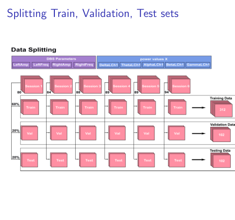
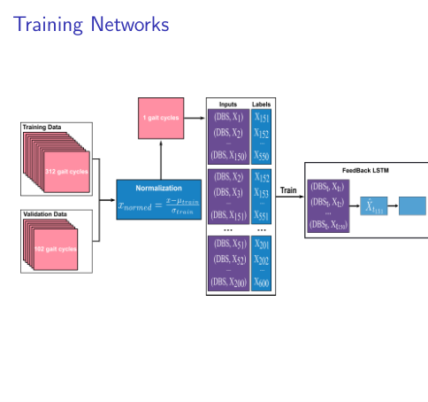
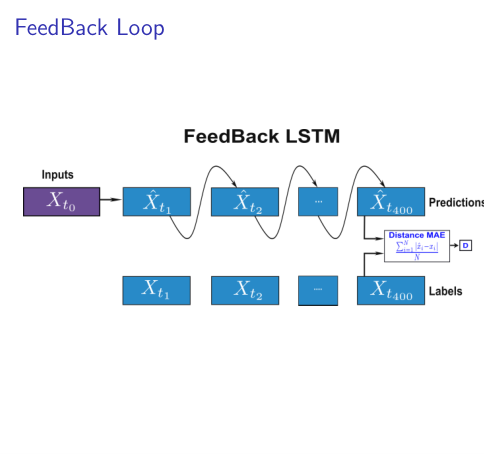
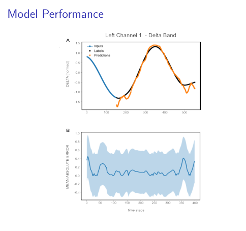
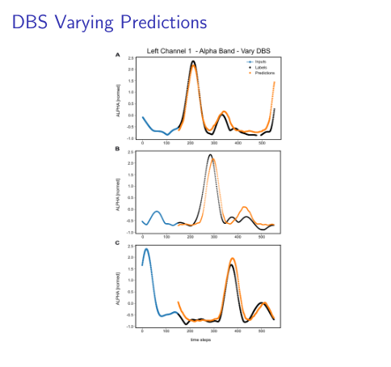

# FeedBack LSTM: forecasting brain band powers during gait under DBS

This project trains LSTM models to forecast brain-signal band powers (Delta, Theta, Alpha, Beta, Gamma) recorded during gait cycles, given the patient's deep brain stimulation (DBS) settings. A model sees the first 150 timesteps of a gait cycle and predicts the next 400.

Two models are compared on the same data:
- **FeedBack** (closed loop): predicts one timestep at a time, feeding each prediction back in as its next input.
- **DirectLSTM**: reads the same input and predicts all 400 timesteps at once.

📊 **Presentation:** *Forecasting Delta, Theta, Alpha, Beta, and Gamma Powers Using LSTM* (Thi Giang and Gautam Kumar, San José State University, October 2024). The figures in this README are taken from it.

---

## Contents
- [How it works](#how-it-works)
- [Results](#results)
- [Files](#files)
- [Setup](#setup)
- [How to run](#how-to-run)
- [Limitations](#limitations)

---

## How it works

### 1. Data
The data is 6 recording sessions, each stored as a `.mat` file. Each session holds 80–94 gait cycles, and each gait cycle is an array of shape `(timesteps, 45)`, with 604–694 timesteps per cycle:

| Columns | Meaning |
|---|---|
| 0–3 | DBS settings: `DBSLAmp`, `DBSLFreq`, `DBSRAmp`, `DBSRFreq` |
| 4–43 | Band powers: Left/Right × Channel 1–4 × Delta/Theta/Alpha/Beta/Gamma |
| 44 | `WPI` |

The models use 9 of these columns: the 4 DBS settings and the 5 Left Channel 1 band powers (Delta to Gamma). The band powers are both inputs and prediction targets; the DBS settings are inputs only. To predict other bands, edit `PREDICTED_FEATURES` in [dataset.py](dataset.py).

These arrays were extracted from the raw session structure (wavelet power, averaged over each band's frequency range with `trapz`, and cut into gait cycles using the gait events).

### 2. Train / validation / test split
Each session is split **chronologically by gait cycle** into 60% train, 20% validation and 20% test. The six sessions are then pooled, giving **312 / 106 / 106 gait cycles**. Every split therefore contains cycles from every session.



### 3. Normalization and windowing
- Every column is mean-normalized, `(x − mean) / (max − min)`, with statistics from the training split only.
- Each gait cycle is cut into windows of **150 input steps → 400 predicted steps**. Training and validation windows start every 5 timesteps (5,647 and 1,961 windows). For testing, one window is taken from the start of each gait cycle (106 windows).



### 4. The models
Both models have two stacked LSTM layers (414 units each) followed by two Dense layers, and are trained with MAE loss and Adam ([modelutils.py](modelutils.py)).

**FeedBack**
1. **Warm-up:** the whole input window passes through both LSTM layers, which produces the first prediction.
2. **Feedback loop:** for each of the remaining 399 steps, the previous prediction is joined with the DBS settings and fed back into the LSTM cells, one step at a time.



**DirectLSTM** reads the input window with the same LSTM layers, then a Dense head outputs all 400 steps at once. It runs 150 LSTM steps per window instead of 549, so it trains about 2.5× faster per epoch, and errors cannot build up from step to step.

---

## Results

The presentation showed the training curve, predictions vs. labels and MAE per timestep for the Delta, Theta, Alpha, Beta and Gamma bands (Left Channel 1), and predictions when the DBS settings are varied. Its conclusion: a **proof of concept that an LSTM can model the band powers**. Two of its figures:

**Delta band, Left Channel 1.** (A) Blue: input history. Black: true values. Orange: closed-loop prediction. (B) Mean absolute error at each predicted timestep over the test set.



**Predictions under different DBS settings (Alpha band).**



> **Note:** the presentation used an earlier configuration: FeedBack only, 256 LSTM units, 5 output bands for Left Channel 1, MSE loss and 200 epochs. The code in this repository is the later version described above.

---

## Files

| File | Purpose |
|---|---|
| [train.py](train.py) | **Main script.** Trains and evaluates FeedBack or DirectLSTM, then saves weights, history, test predictions and plots |
| [finetune.py](finetune.py) | Bayesian hyperparameter search (`scikit-optimize`) on the same data and settings as `train.py` |
| [eda.py](eda.py) | Data summary: gait cycles per split, cycle lengths, column ranges, DBS settings per session, window shapes, and two plots |
| [dataset.py](dataset.py) | Column definitions and the shared data pipeline (load → split → normalize → windows) |
| [modelutils.py](modelutils.py) | The `FeedBack` and `DirectLSTM` models, plus `ModelUtils` (compile & fit, window building, plotting) |
| [utils.py](utils.py) | `LoadData` (reads the `.mat` sessions), `NormalizedData` (flatten / normalize / un-flatten variable-length gait cycles), `split_train_val_test` |
| [configs.py](configs.py) | Data and output paths, read from environment variables |
| [requirements.txt](requirements.txt) | Python packages |
| [docs/](docs/) | Figures from the presentation, used in this README |

Every script starts with a docstring explaining what it does and how to run it.

---

## Setup

Developed with Python 3.12 and TensorFlow 2.21 (Keras 3).

```bash
python -m venv .venv
source .venv/bin/activate
pip install -r requirements.txt
```

On Apple silicon, TensorFlow can use the GPU if the `tensorflow-metal` plugin is installed for a TensorFlow version it supports.

Then tell the code where your data is. The data itself (the patient `.mat` files) is **not** included in this repository. Paths are read from environment variables in [configs.py](configs.py):

| Variable | Contents | Default |
|---|---|---|
| `FEEDBACK_DATA_DIR` | folder with the patient `.mat` files | `./data` |
| `FEEDBACK_IMAGES_DIR` | plots | `./results/images` |
| `FEEDBACK_RESULTS_DIR` | weights, histories, predictions | `./results/models` |

Either put the `.mat` files in `./data`, or set the variables:

```bash
export FEEDBACK_DATA_DIR=/path/to/your/data
```

or put them in a `.env` file in this folder, one `NAME=value` per line (VS Code loads `.env` automatically when running Python files; `.env` is git-ignored).

---

## How to run

Run the scripts from inside this folder.

```bash
# 1. look at the data
python eda.py

# 2. (optional) search for hyperparameters; prints a settings block to paste into train.py
python finetune.py --model feedback --trials 30

# 3. train and evaluate a model
python train.py --model feedback
python train.py --model direct
```

`train.py` options: `--epochs` (default 300) and `--patience` (early-stopping patience, default 20). The other settings (window sizes, model sizes, learning rate, batch size) are in the settings block at the top of the file.

**Training is safe to interrupt.** Progress is backed up after every epoch, and running the same command again resumes where it stopped. Training a full run takes hours on a laptop CPU; on macOS, `caffeinate -i python train.py --model feedback` keeps the machine awake until it finishes.

**Outputs** are named after the model and its settings (for example `feedback_150to400_stride5_bs128_lr7.9e-05`):

| Folder | Files |
|---|---|
| `FEEDBACK_RESULTS_DIR` | best weights (`.weights.h5`), per-epoch log (`_log.csv`), full history and test predictions (`.pkl`) |
| `FEEDBACK_IMAGES_DIR` | loss curves, and one prediction plot per band for a test example |

At the end of training, `train.py` prints the test MAE overall (normalized units) and per band (original units).

---

## Limitations

- **One DBS setting per session.** Each of the 6 sessions uses a single DBS setting, and the 6 settings all differ. Within this data the DBS columns therefore also identify the session, so the models cannot separate the effect of DBS from other differences between sessions.
- **Hyperparameters.** The current model sizes and learning rate come from a search on an earlier version of the data setup (3 bands, StandardScaler). Rerun `finetune.py` to tune them for the current setup.
- **Unused arguments.** `modelutils.FeedBack` accepts `activation_dense` and `use_bias`, but does not apply them: both Dense layers are linear with no bias.
